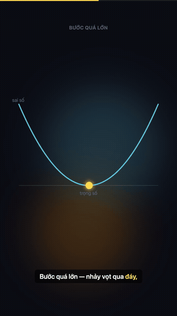

# prompt-to-video

[](LICENSE)

A [Claude Code](https://claude.com/claude-code) Skill that turns a plain-language prompt into
a narrated, captioned, ready-to-post video — using [Remotion](https://remotion.dev) to render
React components to MP4.

Tell Claude what you want ("make a TikTok video explaining gradient descent") and it writes
the script, generates AI narration, aligns frame-accurate captions, builds the animated scenes,
previews them, and renders the final video — end to end, in one conversation.

<p align="center">
  
</p>

<p align="center"><em>↑ 4.5s clip from <a href="examples/gradient-descent.mp4">examples/gradient-descent.mp4</a> — full video, script, and prompt below</em></p>

## Why this exists

Writing video code is normally flying blind: you write a scene, wait minutes for a full
render, and only then find out the camera jitters or the text runs off-screen. And narrated
explainer videos have a second, harder problem — every time you tweak a line of narration,
every animation timed against the old audio drifts out of sync.

This skill closes both loops:

- **See before you render.** A sparse-frame preview renders a handful of stills in seconds,
  so Claude (and you) can look at the actual output before committing to a multi-minute render.
- **Animation follows the words, not a frame number.** Narration timing comes from forced
  alignment against the real audio, so scene animations are anchored to *phrases* ("the moment
  it says 'multiply'") instead of hardcoded frame counts. Re-record the narration and every
  animation re-times itself automatically.

## Features

- **Script-driven pipeline** — one `script.json` file is the only thing you hand-edit; audio,
  captions, and cue timings are all generated from it and kept in sync automatically
- **Three TTS backends, auto-selected** by what's installed:
  - [VieNeu-TTS](https://github.com/pnnbao97/VieNeu-TTS) — local, free, Vietnamese + English,
    instant voice cloning from a 3–8s sample, Apache 2.0
  - MiniMax — cloud, paid, voice cloning, strong for Chinese and other languages
  - Edge TTS — cloud, free, fixed preset voices, zero setup
- **Frame-accurate captions** via Whisper forced alignment — timestamps come from Whisper,
  spelling comes from your own script, so captions are never mistranscribed
- **Speech cues** — name a phrase in the narration (`"cues": {"window": "this window"}`) and
  animations can anchor to the exact frame it's spoken, via `useCue()` / `useCueProgress()` /
  `useAfterCue()`
- **Preview loop** — render sparse stills into one contact sheet and actually look at them
  before spending minutes on a full render
- **Content-aware incremental generation** — audio only regenerates when the text or voice
  actually changed, not just because the mp3 happens to be missing
- **Scene shell (`SceneLayout`)** — safe-area insets for vertical video (TikTok/Reels/Shorts),
  an ambient drifting background, and a spring entrance animation, applied consistently across
  every scene
- Built on the [3Blue1Brown-style](#) visualization principles baked into `SKILL.md`: color as
  semantics, build up step by step, ask "why" before showing "what"

## See it in action

[`examples/gradient-descent.mp4`](examples/gradient-descent.mp4) — a 58-second vertical video
explaining gradient descent, generated end-to-end by this skill from the prompt:

> *"làm cái video tiktok giải thích gradient trong deep learning đi"*
> ("make a TikTok video explaining gradient in deep learning")

It's the second video in a two-part series (part one covers backpropagation). Everything in
it — the script, the loss-valley visualization, the cloned narration voice, the karaoke
captions — was produced by Claude following this skill, with a human reviewing preview stills
and giving feedback between passes (not a single unsupervised run).

## Installation

Clone this repo into your Claude Code skills directory:

```bash
git clone https://github.com/Thach45/prompt-to-video.git
cp -r prompt-to-video ~/.claude/skills/remotion-video
```

Restart Claude Code (or start a new session) and the skill activates automatically when you
ask for a video.

### Dependencies

```bash
brew install ffmpeg              # macOS   (Ubuntu/Debian: sudo apt install ffmpeg)
pip install faster-whisper       # captions + speech cues
pip install pillow               # optional: labels on preview contact sheets
```

Then install at least one TTS backend:

```bash
pip install vieneu               # local, free, Vietnamese/English (recommended)
pip install edge-tts             # cloud, free, preset voices
# or, for MiniMax:
export MINIMAX_API_KEY="..." MINIMAX_VOICE_ID="..."
```

`"provider": "auto"` in `script.json` picks whichever backend is actually available.

## Usage

Just describe the video you want:

- "make a video with code explaining Python decorators"
- "làm cho tôi video giải thích thuật toán A*"
- "/remotion-video — TikTok video about the chain rule"

Claude will draft a scene-by-scene script for you to review, then generate narration,
captions, and the animated scenes, preview them, and render the final MP4 — checking in with
you along the way rather than running the whole pipeline unsupervised.

## How it works

`script.json` is the single source of truth. Everything else is generated from it.

```
script.json  ──generate_audio.py──▶  public/audio/*.mp3
                                     src/generated/audioConfig.ts
             ──align_captions.py──▶  src/generated/captions.ts    (captions + speech cues)
             ──preview.py─────────▶  out/preview/*.png            (look before you render)
```

```bash
python scripts/generate_audio.py     # incremental: only re-synthesizes changed narration
python scripts/align_captions.py     # captions + speech cues, via forced alignment
python scripts/preview.py            # render stills and look at them — don't skip this
npx remotion render Main out/video.mp4
```

A minimal `script.json`:

```json
{
  "compositionId": "Main",
  "fps": 30,
  "lang": "vi",
  "voice": { "provider": "auto" },
  "scenes": [
    {
      "id": "03-conv",
      "title": "Convolution",
      "text": "This window covers nine pixels. We multiply each pixel by its weight, then add it all up.",
      "cues": { "window": "This window", "multiply": "multiply", "sum": "add it all up" }
    }
  ]
}
```

See [`SKILL.md`](SKILL.md) for the full guide — animation techniques, the caption/cue system,
the preview workflow, tutorial-video architecture, 3D video with `@remotion/three`, and a long
list of hard-won pitfalls (WebGL context limits, camera jitter, rotated grids, unclamped
progress values, and more).

## Project structure

What a generated video project looks like:

```
my-video-project/
├── script.json             # narration, voice config, cues -- the only file you edit by hand
├── src/
│   ├── Root.tsx
│   ├── generated/          # AUTO-GENERATED, do not edit
│   │   ├── audioConfig.ts  #   scene timings
│   │   └── captions.ts     #   word-level captions + cue frames
│   ├── SceneLayout.tsx     # safe-area frame + ambient background + entrance spring
│   ├── useCue.ts           # hooks: useCue, useCueProgress, useAfterCue, useSceneIndex ...
│   ├── Captions.tsx        # <CaptionsTrack /> subtitle component
│   └── scenes/
├── public/audio/           # generated narration
├── out/preview/            # preview stills
└── scripts/
    ├── generate_audio.py
    ├── align_captions.py
    └── preview.py
```

And this repo itself (the skill):

```
prompt-to-video/
├── SKILL.md                 # the instructions Claude reads to use this skill
├── scripts/                 # the pipeline: generate_audio.py, align_captions.py, preview.py
├── templates/
│   ├── script.example.json
│   ├── voices/nhat-phong.wav # bundled default cloned voice
│   └── src/                  # useCue.ts, Captions.tsx, SceneLayout.tsx, theme.ts
├── examples/                 # example output (see "See it in action" above)
└── requirements.txt
```

## TTS options compared

| Option | Language | Voice cloning | Cost | Hardware |
|--------|----------|----------------|------|----------|
| **VieNeu-TTS** | Vietnamese / English | ✅ instant, 3–8s sample | Free (Apache 2.0) | CPU is enough; ~7× realtime on Apple Silicon |
| **MiniMax** | Chinese + many others | ✅ cloud | Billed per character | None (cloud) |
| **Edge TTS** | Many languages | ❌ fixed voices | Free | None (cloud) |

Full details, voice lists, and pitfalls (wrong API host, watermarking defaults, etc.) are in
[`SKILL.md`](SKILL.md).

## Requirements

- Node.js 18+
- Python 3.9+ (3.10+ if you use VieNeu-TTS)
- ffmpeg / ffprobe

## Acknowledgments

- Forked from [wshuyi/remotion-video-skill](https://github.com/wshuyi/remotion-video-skill),
  the original Remotion-authoring skill this project builds on
- [VieNeu-TTS](https://github.com/pnnbao97/VieNeu-TTS) for local Vietnamese voice synthesis
  and cloning
- [Remotion](https://remotion.dev) for making video-as-React possible in the first place

## License

MIT — see [LICENSE](LICENSE).
